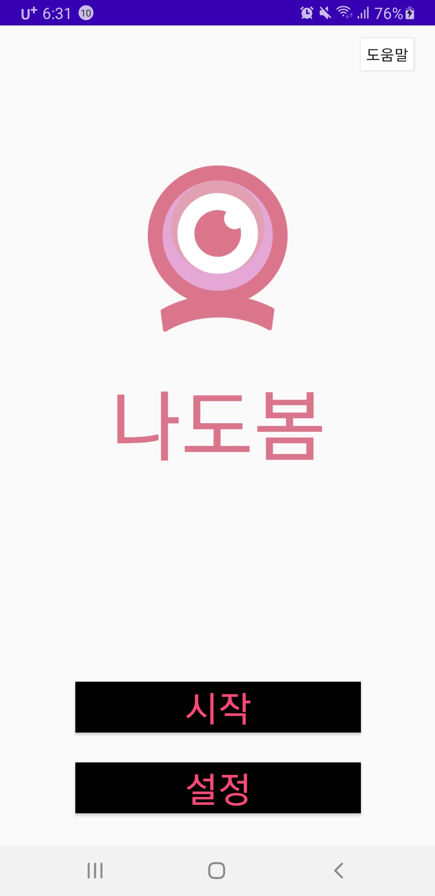
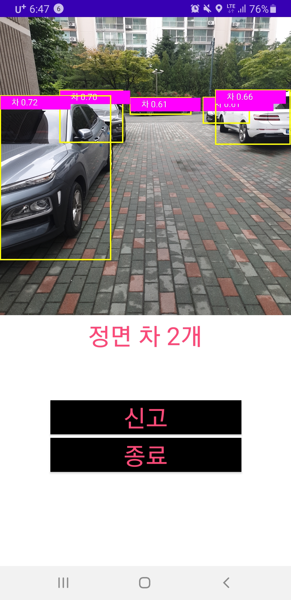
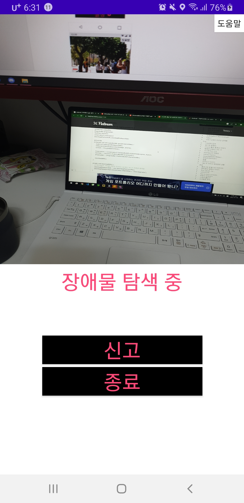
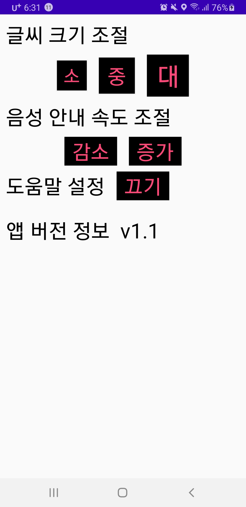
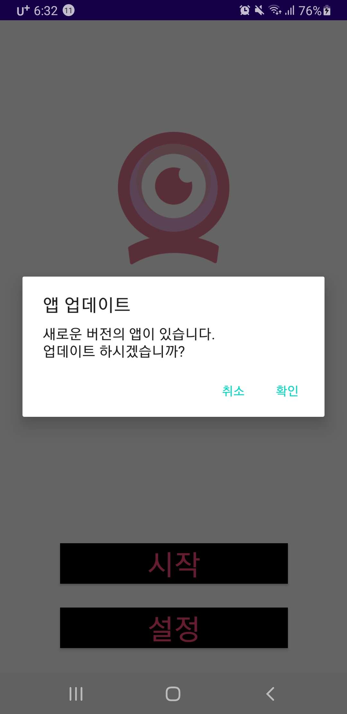

# Nadobom

  

나도봄 애플리케이션은 **시각장애인이 도보로 다닐 때 지팡이 외에도 길 위의 장애물에 대해 안내를 받을 수 있는 무언가 있으면 좋겟다**는 마음에서 시작한 프로젝트 입니다.

지팡이는 시각장애인에게 외출 시 도움이 많이 되는 제품이지만, 자전거나 길 위의 장애물에 의해 쉽게 고장날 수 있는 제품입니다. 또한 지팡이가 감지할 수 없는 장애물도 있습니다. 저희는 이 지팡이에 문제가 생겼거나 지팡이와 같이 시각장애인을 보조하는 **휴대폰을 이용해 장애물을 안내하는 앱을 만드는 것**이 저희의 목표입니다.

나도봄의 **주요 기능**은 다음과 같습니다.

1. **장애물 음성 안내**
2. 길을 다니다 불편한 **장애물 신고**

## About

### 관련 주소

**소개 영상**
- 유튜브 : https://youtu.be/yczxKZNHXbQ

**깃 주소**
- 백엔드 : https://github.com/HwangJaeMyoung/nadobom_BE

### 개발팀

**프론트엔드**
| 김태영 |
| --- |
| kimty131@gmail.com |
| [@nulzi](https://github.com/nulzi) |

**백엔드&AI**
| 변호민 | 조성만 | 황재명 |
| --- | --- | --- |
| ???@gmail.com | ???@gmail.com | ???@gmail.com |
| [@homin1209](https://github.com/homin1209) | [@BetterCodings](https://github.com/BetterCodins) | [@HwangJaeMyoung](https://github.com/HwangJaeMyoung) |

## 시작 가이드

졸업 작품 프로젝트로 현재 서버는 동작하지 않는 상태입니다. 서버의 사용이 필요한 경우 백엔드 주소로 이동해 코드를 활용해 주시기 바랍니다.

### 앱 사용 방법
- 구글 드라이브 공유(압축 파일) : https://drive.google.com/file/d/1kUWw7JXdQd1dMo0VpTMFJ_McKPqX8qrl/view?usp=sharing

### 코드 사용 방법

**개발 환경**
- windows10
- Android Studio : 2022.1.1.21-windows
- Java : 11.0.15

깃허브 코드 사용 (https://github.com/pytorch/android-demo-app/blob/master/ObjectDetection/README.md)
기존 코드에서 live 부분의 코드를 바꾸고 액티비티를 추가해서 활요했으므로 코드는 깃허브 코드와 현재 소스 코드를 모두 참고해주시기 바랍니다.

## 화면 및 기능

### 시작 화면

| 시작 화면 | 설명 |
| --- | --- |
|  | **시작 화면** 장애물 안내 기능을 사용할 수 있는 '시작' 버튼과 사용자에 맞는 설정이 가능한 '설정' 버튼이 있다. |

### 메인 화면

| 메인 화면1 | 설명 |
| --- | --- |
|  | **메인 화면1** 카메라에 잡히는 장애물이 존재하는 경우 장애물에 대한 문구와 함께 안내 음성이 동작한다.   사용자가 지나다니다 불편한 도보나 장애물을 만나게 되면 신고를 통해 관리자에게 사진과 gps를 통한 위치가 전달되어 대신 신고해준다.  '종료' 버튼을 통해 안내를 종료한다.|

| 메인 화면2 | 설명 |
| --- | --- |
|  | **메인 화면2** 장애물이 없는 경우 '장애물 탐색 중'이라는 문구와 함께 다음 장애물을 탐색한다. |

### 설정 화면

| 설정 화면 | 설명 |
| --- | --- |
|  | **설정 화면** 제공하는 기능은 다음과 같다. - 글씨 크기 조절 - 음성 안내 속도 조절 - 도움말 기능 조절 - 앱의 버전 확인 |

### 업데이트 화면

| 업데이트 화면 | 설명 |
| --- | --- |
|  | **업데이트 화면** 앱의 버전을 확인해 더 상위 버전의 앱이 존재할 경우 서버에서 받아와 업데이트한다. |

### 도움말 기능

화면의 우측 상단의 버튼을 통해 해당 화면에 대한 도움말을 들을 수 있다.
